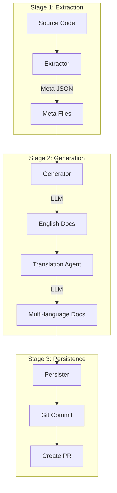

# DocsAgent

An LLM-powered documentation automation tool for StarRocks that automatically extracts metadata from source code and generates multi-language technical documentation.

[](https://www.python.org/)
[](https://python-poetry.org/)
[](LICENSE)

## ✨ Features

- 🚀 **Automated Extraction**: Automatically extract metadata for configs, variables, and functions from StarRocks source code
- 🤖 **Intelligent Generation**: LLM-powered generation of descriptions, parameter explanations, and usage examples
- 🌍 **Multi-language Support**: Support for Chinese, English, and Japanese with intelligent translation routing
- 📝 **Consistent Styling**: Aligned with official StarRocks documentation style
- 🔧 **Extensible Architecture**: Generic Protocol-based Pipeline design for easy extension
- 🛠️ **Tool-Enhanced**: Integrated code search tools for more accurate context

## 📋 Supported Document Types

| Type             | Description                                     | Status |
| ---------------- | ----------------------------------------------- | ------ |
| FE Config        | Frontend configuration documentation            | ✅      |
| BE Config        | Backend configuration documentation             | ✅      |
| System Variables | Session/Global variables documentation          | ✅      |
| SQL Functions    | Scalar/Aggregate/Window functions documentation | ✅      |

## 🏗️ Architecture

### Design Philosophy

DocsAgent adopts a **Protocol-based Pipeline architecture** that emphasizes:
- **Duck Typing**: Using Python Protocols instead of inheritance for flexibility
- **Generic Pipeline**: Type-safe pipeline that works with any `DocumentableItem`
- **Domain Separation**: Each document type (config/variable/function) is a separate domain
- **3-Stage Flow**: Extractor → Generator → Persister pattern for all domains

### Workflow



## 🚀 Quick Start

### Requirements

- Python 3.10+
- Poetry (package manager)
- StarRocks source code (for metadata extraction)

### Installation

```bash
# Clone the repository
git clone https://github.com/Seaven/DocsAgent.git
cd DocsAgent

# Install dependencies
poetry install

# Activate virtual environment
poetry shell
```

### Configuration

Copy and edit the configuration file:

```bash
cp conf/example.conf conf/agent.conf
```

Key configuration options:

```ini
# StarRocks source code path (required)
STARROCKS_HOME=/path/to/starrocks

# LLM configuration
LLM_MODEL=openai:gpt-4o-mini
LLM_API_KEY=your_api_key

# need config if llm isn't OpenAI/Gemini/Claude
# LLM_URL=https://api.openai.com/v1 
# LLM_PROVIDER=openai
LLM_TEMPERATURE=0.1
LLM_MAX_TOKENS=5000

# Output configuration
DOCS_OUTPUT_DIR=./output
META_DIR=./meta
TARGET_LANGS=["en", "zh", "ja"]

# StarRocks client (for SQL validation)
SR_HOST=localhost
SR_PORT=9030
SR_USER=root
SR_PASSWORD=

# Logging
LOG_DIR=./logs
LOG_LEVEL=INFO
```

> **Note**: Configuration priority is: Environment variables > Config file > Defaults

### Basic Usage

### Command Line Arguments

| Argument                  | Description                                             |
| ------------------------- | ------------------------------------------------------- |
| `-e, --extract`           | Extract metadata from source code                       |
| `-g, --generate`          | Generate documentation                                  |
| `-m, --meta`              | Generate metadata without generating docs               |
| `-t, --type`              | Document type (fe_config/be_config/variables/functions) |
| `--config`                | Configuration file path                                 |
| `-f, --force_search_code` | Force code re-search                                    |
| `-i, --ignore_miss_usage` | Ignore missing usage information                        |
| `-wl, --without-llm`      | Run without LLM (use existing docs)                     |
| `-l, --limit`             | Limit number of items to process                        |
| `--ci`                | Enable Git commit                                       |
| `--pr`                | Enable Pull Request creation                            |
| `-v, --track-version`      | Enable track introduced version                           |

```bash
# Incremental Mode: 
# 1. Extract meta from documents first, to compute the meta for calculate increments (keep the exists docs)
# 2. Generate documents

# Full Mode:
# 1. Generate docuemnts without extract meta from documents

# Example
# FE/BE configs increments
# 1. Extract FE config meta from documentation
python -m docsagent.main -e -t fe_config

# 2. Generate FE config documentation and create git pr 
python -m docsagent.main -g -t fe_config --track-version --pr

# FE/BE configs full
# 1. Generate FE config documentation with limit and create git pr 
python -m docsagent.main -g -t fe_config -l 10 --track-version --pr

# Variables
# 1. Extract Variables meta from documentation
python -m docsagent.main -e -t variables

# 2. Generate Variables documentation
python -m docsagent.main -g -t variables --track-version --ci

# Functions
# 1. Extract Functions meta from documentation
python -m docsagent.main -e -t variables

# 2. Generate Functions documentation without llm generate
python -m docsagent.main -g -t variables --track-version -wl
```

## 🔧 Development Guide
For detailed usage, see [dev-guide.md](dev-guide.md)

## 📊 Output Examples

### Metadata Structure

Each item is stored as a JSON file in `meta/`:

```json
// meta/functions/abs.meta
{
  "name": "abs",
  "catalog": "mathematical-functions",
  "signature": ["DOUBLE abs(DOUBLE x)"],
  "description": "Returns the absolute value",
  "return_type": "DOUBLE",
  "documents": {
    "en": "# abs\n\n## Description\n\nReturns the absolute value...",
    "zh": "# abs\n\n## 功能\n\n返回绝对值...",
    "ja": "# abs\n\n## 説明\n\n絶対値を返します..."
  },
  "related_functions": ["sign", "floor", "ceil"]
}
```

### Directory Structure of Output

```
output/
├── en/                                 # English documentation
│   ├── FE_configuration.md             # FE config consolidated
│   ├── BE_configuration.md             # BE config consolidated
│   ├── System_variable.md              # Variables consolidated
│   └── functions/                      # Function docs
│       ├── array-functions/
│       │   ├── array_append.md
│       │   └── array_concat.md
│       ├── string-functions/
│       │   ├── concat.md
│       │   └── substring.md
│       └── mathematical-functions/
│           ├── abs.md
│           └── sqrt.md
├── zh/                                 # Chinese documentation (same structure)
│   ├── FE_configuration.md
│   └── functions/
│       └── ...
└── ja/                                 # Japanese documentation (same structure)
    ├── FE_configuration.md
    └── functions/
        └── ...
```

## 📄 License

This project is licensed under the Apache 2.0 License - see the [LICENSE](LICENSE) file for details