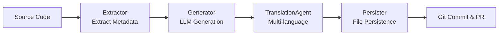

# DocsAgent

An LLM-powered documentation automation tool for StarRocks that automatically extracts metadata from source code and generates multi-language technical documentation.

[](https://www.python.org/)
[](https://python-poetry.org/)
[](LICENSE)

## ✨ Features

- 🚀 **Automated Extraction**: Automatically extract metadata for configs, variables, and functions from StarRocks source code
- 🤖 **Intelligent Generation**: LLM-powered generation of descriptions, parameter explanations, and usage examples
- 🌍 **Multi-language Support**: Support for Chinese, English, and Japanese with intelligent translation routing
- 📝 **Consistent Styling**: Aligned with official StarRocks documentation style
- 🔧 **Extensible Architecture**: Generic Protocol-based Pipeline design for easy extension
- 🛠️ **Tool-Enhanced**: Integrated code search tools for more accurate context

## 📋 Supported Document Types

| Type             | Description                                     | Status |
| ---------------- | ----------------------------------------------- | ------ |
| FE Config        | Frontend configuration documentation            | ✅      |
| BE Config        | Backend configuration documentation             | ✅      |
| System Variables | Session/Global variables documentation          | ✅      |
| SQL Functions    | Scalar/Aggregate/Window functions documentation | ✅      |

## 🏗️ Architecture

### Core Components

```
DocsAgent
├── Core Pipeline           # Generic documentation generation pipeline
│   ├── Protocol            # Interface protocol definitions
│   ├── Pipeline            # Generic pipeline implementation
│   └── GitPersister        # Git integration
│
├── Domains                 # Domain modules
│   ├── FE Config           # FE configuration domain
│   ├── BE Config           # BE configuration domain
│   ├── Variables           # Variables domain
│   └── Functions           # Functions domain
│       ├── Extractor       # Metadata extractor
│       ├── Generator       # Documentation generator
│       └── Persister       # File persistence
│
├── Agents                  # LLM Agents
│   ├── ConfigDocAgent      # Config documentation agent
│   ├── TranslationAgent    # Translation agent
│   └── Tools               # Agent tools
│
└── Tools                   # Utilities
    ├── CodeSearch          # Code search (Hyperscan-based)
    ├── CodeTools           # Code analysis tools
    └── GitOperator         # Git operations
```

### Workflow



### Generic Pipeline

```python
# Type-safe generic Pipeline
DocGenerationPipeline[T: DocumentableItem]
    ├── ItemExtractor[T]       # Extractor
    ├── DocGenerator[T]        # Generator  
    ├── TranslationAgent       # Translator
    └── DocPersister[T]        # Persister
```

## 🚀 Quick Start

### Requirements

- Python 3.10+
- Poetry (package manager)
- StarRocks source code (for metadata extraction)

### Installation

```bash
# Clone the repository
git clone https://github.com/Seaven/DocsAgent.git
cd DocsAgent

# Install dependencies
poetry install

# Activate virtual environment
poetry shell
```

### Configuration

Copy and edit the configuration file:

```bash
cp conf/example.conf conf/agent.conf
```

Main configuration options:

```ini
# StarRocks source code path
STARROCKS_HOME=/path/to/starrocks

# LLM configuration
LLM_MODEL=openai:gpt-4
LLM_API_KEY=your_api_key
LLM_PROVIDER=openai

# Output configuration
DOCS_OUTPUT_DIR=./output
META_DIR=./meta
TARGET_LANGS=["en", "zh", "ja"]
```

### Basic Usage

```bash
# 1. Extract and generate FE config documentation
python -m docsagent.main -e -g -t fe_config

# 2. Generate BE config documentation and commit to Git
python -m docsagent.main -g -t be_config --git-ci

# 3. Generate variables documentation and create PR
python -m docsagent.main -g -t variables --git-ci --git-pr

# 4. Extract function metadata only
python -m docsagent.main -e -t functions

# 5. Force code re-search with limited count
python -m docsagent.main -g -t fe_config -f -l 10
```

## 📚 Usage Guide

### Command Line Arguments

| Argument                  | Description                                             |
| ------------------------- | ------------------------------------------------------- |
| `-e, --extract`           | Extract metadata from source code                       |
| `-g, --generate`          | Generate documentation                                  |
| `-t, --type`              | Document type (fe_config/be_config/variables/functions) |
| `--config`                | Configuration file path                                 |
| `-f, --force_search_code` | Force code re-search                                    |
| `-i, --ignore_miss_usage` | Ignore missing usage information                        |
| `-l, --limit`             | Limit number of items to process                        |
| `--git-ci`                | Enable Git commit                                       |
| `--git-pr`                | Enable Pull Request creation                            |

For detailed usage, see [CLI_USAGE.md](CLI_USAGE.md)

### Programming Interface

## 🚀 快速开始

### 环境要求

- Python 3.10+
- Poetry (包管理工具)
- StarRocks 源码（用于提取元信息）

### 安装

```bash
# 克隆仓库
git clone https://github.com/Seaven/DocsAgent.git
cd DocsAgent

# 安装依赖
poetry install

# 激活虚拟环境
poetry shell
```

### 配置

复制并编辑配置文件：

```bash
cp conf/example.conf conf/agent.conf
```

主要配置项：

```ini
# StarRocks 源码路径
STARROCKS_HOME=/path/to/starrocks

# LLM configuration
LLM_MODEL=openai:gpt-4
LLM_API_KEY=your_api_key
LLM_PROVIDER=openai

# Output configuration
DOCS_OUTPUT_DIR=./output
META_DIR=./meta
TARGET_LANGS=["en", "zh", "ja"]
```

### Basic Usage

```bash
# 1. Extract and generate FE config documentation
python -m docsagent.main -e -g -t fe_config

# 2. Generate BE config documentation and commit to Git
python -m docsagent.main -g -t be_config --git-ci

# 3. Generate variables documentation and create PR
python -m docsagent.main -g -t variables --git-ci --git-pr

# 4. Extract function metadata only
python -m docsagent.main -e -t functions

# 5. Force code re-search with limited count
python -m docsagent.main -g -t fe_config -f -l 10
```

## 📚 Usage Guide

### Command Line Arguments

| Argument                  | Description                                             |
| ------------------------- | ------------------------------------------------------- |
| `-e, --extract`           | Extract metadata from source code                       |
| `-g, --generate`          | Generate documentation                                  |
| `-t, --type`              | Document type (fe_config/be_config/variables/functions) |
| `--config`                | Configuration file path                                 |
| `-f, --force_search_code` | Force code re-search                                    |
| `-i, --ignore_miss_usage` | Ignore missing usage information                        |
| `-l, --limit`             | Limit number of items to process                        |
| `--git-ci`                | Enable Git commit                                       |
| `--git-pr`                | Enable Pull Request creation                            |

For detailed usage, see [CLI_USAGE.md](CLI_USAGE.md)

### Programming Interface

```python
from docsagent.domains import factory

# Create FE config documentation pipeline
pipeline = factory.create_fe_config_pipeline()

# Run pipeline
pipeline.run(
    source='/path/to/starrocks',
    output_dir='./output',
    target_langs=['en', 'zh', 'ja'],
    auto_commit=True,
    create_pr=True
)
```

## 🔧 Development Guide

### Directory Structure

```
DocsAgent/
├── conf/                   # Configuration files
├── src/docsagent/          # Source code
│   ├── core/               # Core components
│   │   ├── pipeline.py     # Generic pipeline
│   │   ├── protocols.py    # Interface protocols
│   │   └── git_persister.py # Git integration
│   ├── domains/            # Domain modules
│   │   ├── models.py       # Data models
│   │   ├── factory.py      # Pipeline factory
│   │   ├── fe_config/      # FE config domain
│   │   ├── be_config/      # BE config domain
│   │   ├── variables/      # Variables domain
│   │   └── functions/      # Functions domain
│   ├── agents/             # LLM Agents
│   │   ├── config_doc_agent.py
│   │   ├── translation_agent.py
│   │   └── tools.py
│   └── tools/              # Utilities
├── meta/                   # Metadata output
├── output/                 # Generated documentation
├── tests/                  # Tests
└── docs_module/            # Documentation templates
```

### Adding New Document Types

1. **Define Data Model** (implement `DocumentableItem` protocol)

```python
from docsagent.core.protocols import DocumentableItem

@dataclass
class MyItem:
    name: str
    documents: Dict[str, str] = field(default_factory=dict)
    # ... other fields
```

2. **Implement Three Core Components**

```python
# Extractor: Extract metadata from source code
class MyExtractor(ItemExtractor[MyItem]):
    def extract(self, source: str) -> List[MyItem]:
        # Implement extraction logic
        pass

# Generator: Generate documentation using LLM
class MyGenerator(DocGenerator[MyItem]):
    def generate(self, item: MyItem, lang: str) -> str:
        # Implement generation logic
        pass

# Persister: Persist documentation
class MyPersister(DocPersister[MyItem]):
    def save(self, items: List[MyItem], output_dir: Path, lang: str):
        # Implement save logic
        pass
```

3. **Create Pipeline Factory Function**

```python
def create_my_pipeline() -> DocGenerationPipeline[MyItem]:
    return DocGenerationPipeline[MyItem](
        extractor=MyExtractor(),
        doc_generator=MyGenerator(),
        translation_agent=TranslationAgent(),
        persister=MyPersister(),
        item_type_name="My Type"
    )
```

### Tech Stack

- **tree-sitter**: Code parsing (Java, C++, Python)
- **Hyperscan**: High-performance regex matching engine
- **LangGraph**: LLM agent workflow orchestration
- **LangChain**: LLM toolchain
- **Pydantic**: Configuration management and data validation

## 🧪 Testing

```bash
# Run all tests
poetry run pytest

# Run specific test
poetry run pytest tests/test_cli.py

# View coverage
poetry run pytest --cov=docsagent
```

## 📊 Output Examples

### Metadata Files (meta/)

```json
{
  "name": "enable_udf",
  "type": "boolean",
  "defaultValue": "false",
  "isMutable": "true",
  "scope": "FE",
  "documents": {
    "en": "...",
    "zh": "...",
    "ja": "..."
  }
}
```

### Generated Documentation (output/)

```
output/
├── en/
│   ├── FE_configuration.md
│   └── functions/
│       └── string-functions/
│           └── LIKE.md
├── zh/
│   ├── FE_configuration.md
│   └── functions/
│       └── string-functions/
│           └── LIKE.md
└── ja/
    └── ...
```

## 🤝 Contributing

Contributions are welcome! Please follow these steps:

1. Fork the repository
2. Create a feature branch (`git checkout -b feature/AmazingFeature`)
3. Commit your changes (`git commit -m 'Add some AmazingFeature'`)
4. Push to the branch (`git push origin feature/AmazingFeature`)
5. Open a Pull Request

### Code Guidelines

- Use English comments
- Follow PEP 8 code style
- Add type annotations
- Write unit tests

## 📄 License

This project is licensed under the Apache 2.0 License - see the [LICENSE](LICENSE) file for details