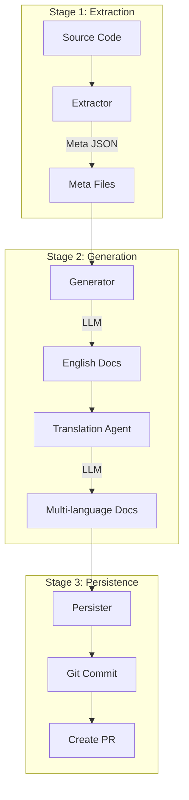

# DocsAgent

An LLM-powered documentation automation tool for StarRocks that automatically extracts metadata from source code and generates multi-language technical documentation.

[](https://www.python.org/)
[](https://python-poetry.org/)
[](LICENSE)

## ✨ Features

- 🚀 **Automated Extraction**: Automatically extract metadata for configs, variables, and functions from StarRocks source code
- 🤖 **Intelligent Generation**: LLM-powered generation of descriptions, parameter explanations, and usage examples
- 🌍 **Multi-language Support**: Support for Chinese, English, and Japanese with intelligent translation routing
- 📝 **Consistent Styling**: Aligned with official StarRocks documentation style
- 🔧 **Extensible Architecture**: Generic Protocol-based Pipeline design for easy extension
- 🛠️ **Tool-Enhanced**: Integrated code search tools for more accurate context

## 📋 Supported Document Types

| Type             | Description                                     | Status |
| ---------------- | ----------------------------------------------- | ------ |
| FE Config        | Frontend configuration documentation            | ✅      |
| BE Config        | Backend configuration documentation             | ✅      |
| System Variables | Session/Global variables documentation          | ✅      |
| SQL Functions    | Scalar/Aggregate/Window functions documentation | ✅      |

## 🏗️ Architecture

### Design Philosophy

DocsAgent adopts a **Protocol-based Pipeline architecture** that emphasizes:
- **Duck Typing**: Using Python Protocols instead of inheritance for flexibility
- **Generic Pipeline**: Type-safe pipeline that works with any `DocumentableItem`
- **Domain Separation**: Each document type (config/variable/function) is a separate domain
- **3-Stage Flow**: Extractor → Generator → Persister pattern for all domains

### Core Components

```
DocsAgent
├── Core Pipeline           # Generic documentation generation pipeline
│   ├── protocols.py        # DocumentableItem Protocol definition
│   ├── pipeline.py         # Generic DocGenerationPipeline[T]
│   └── __init__.py         # Core exports
│
├── Domains                 # Domain-specific implementations
│   ├── models.py           # ConfigItem, FunctionItem, VariableItem
│   ├── factory.py          # Pipeline factory for each domain
│   ├── fe_config/          # FE configuration domain
│   │   ├── extractor.py    # Extract from Config.java
│   │   ├── generator.py    # LLM doc generation
│   │   ├── persister.py    # Save to output/
│   │   └── git_persister.py # Git commit & PR
│   ├── be_config/          # BE configuration domain
│   ├── variables/          # Variables domain (SessionVariable.java)
│   └── functions/          # Functions domain (functions.py)
│
├── Docs Extract            # Metadata extraction modules
│   ├── config_meta_extract.py      # Config extractor
│   ├── function_meta_extract.py    # Function extractor
│   └── variables_meta_extract.py   # Variable extractor
│
├── Agents                  # LLM Agents (LangGraph-based)
│   ├── config_doc_agent.py         # Config documentation agent
│   ├── functions_agent.py          # Function documentation agent
│   ├── variables_agent.py          # Variable documentation agent
│   ├── translation_agent.py        # Translation agent
│   ├── llm.py                      # LLM wrapper
│   └── tools.py                    # Agent tools (code search, etc.)
│
└── Tools                   # Utility modules
    ├── code_search.py      # Hyperscan-based code search
    ├── code_tools.py       # Code manipulation utilities
    ├── file_reader.py      # File reading utilities
    ├── git_operator.py     # Git operations wrapper
    └── sr_client.py        # StarRocks MySQL client
```

### Workflow



### Protocol-based Design

DocsAgent uses Python's `Protocol` (structural subtyping) for maximum flexibility:

```python
@runtime_checkable
class DocumentableItem(Protocol):
    """
    Core abstraction - any item that can be documented.
    No inheritance needed, just implement the interface.
    """
    @property
    def name(self) -> str: ...
    
    @property
    def documents(self) -> Dict[str, str]: ...
    
    def to_dict(self) -> Dict[str, Any]: ...
    
    @classmethod
    def from_dict(cls, data: Dict[str, Any]) -> 'DocumentableItem': ...
```

All domain models (`ConfigItem`, `FunctionItem`, `VariableItem`) implement this protocol without explicit inheritance.

## 🚀 Quick Start

### Requirements

- Python 3.10+
- Poetry (package manager)
- StarRocks source code (for metadata extraction)

### Installation

```bash
# Clone the repository
git clone https://github.com/Seaven/DocsAgent.git
cd DocsAgent

# Install dependencies
poetry install

# Activate virtual environment
poetry shell
```

### Configuration

Copy and edit the configuration file:

```bash
cp conf/example.conf conf/agent.conf
```

Key configuration options:

```ini
# StarRocks source code path (required)
STARROCKS_HOME=/path/to/starrocks

# LLM configuration
LLM_MODEL=openai:gpt-4o-mini
LLM_API_KEY=your_api_key
LLM_URL=https://api.openai.com/v1
LLM_PROVIDER=openai
LLM_TEMPERATURE=0.1
LLM_MAX_TOKENS=5000

# Output configuration
DOCS_OUTPUT_DIR=./output
META_DIR=./meta
TARGET_LANGS=["en", "zh", "ja"]

# StarRocks client (for SQL validation)
SR_HOST=localhost
SR_PORT=9030
SR_USER=root
SR_PASSWORD=

# Logging
LOG_DIR=./logs
LOG_LEVEL=INFO
```

> **Note**: Configuration priority is: Environment variables > Config file > Defaults

### Basic Usage

```bash
# 1. Extract and generate FE config documentation
python -m docsagent.main -e -g -t fe_config

# 2. Generate BE config documentation and commit to Git
python -m docsagent.main -g -t be_config --git-ci

# 3. Generate variables documentation and create PR
python -m docsagent.main -g -t variables --git-ci --git-pr

# 4. Extract function metadata only
python -m docsagent.main -e -t functions

# 5. Force code re-search with limited count
python -m docsagent.main -g -t fe_config -f -l 10
```

## 📚 Usage Guide

### Command Line Arguments

| Argument                  | Description                                             |
| ------------------------- | ------------------------------------------------------- |
| `-e, --extract`           | Extract metadata from source code                       |
| `-g, --generate`          | Generate documentation with LLM                         |
| `-t, --type`              | Document type (fe_config/be_config/variables/functions) |
| `-m, --meta`              | Generate metadata without generating docs                  |
| `--config`                | Configuration file path (default: conf/agent.conf)      |
| `-wl, --without-llm`      | Run without LLM (use existing docs)                     |
| `-f, --force-search`      | Force code search for usage examples                    |
| `-l, --limit`             | Limit number of items to process                        |
| `--git-ci`                | Enable Git commit                                       |
| `--git-pr`                | Enable Pull Request creation                            |

### Typical Workflows

```bash
# Workflow 1: Full pipeline (extract + generate + git)
python -m docsagent.main -e -g -t functions --git-ci --git-pr

# Workflow 2: Only extract metadata (no LLM)
python -m docsagent.main -e -t be_config

# Workflow 3: Generate from existing metadata
python -m docsagent.main -g -t variables

# Workflow 4: Preview metadata without generation
python -m docsagent.main -e -m -t fe_config

# Workflow 5: Process specific items with force search
python -m docsagent.main -g -t functions -f -l 5
```

> **Important**: Always use `python -m docsagent.main` (not `python main.py`)

### Programming Interface

# LLM configuration
LLM_MODEL=openai:gpt-4
LLM_API_KEY=your_api_key
LLM_PROVIDER=openai

# Output configuration
DOCS_OUTPUT_DIR=./output
META_DIR=./meta
TARGET_LANGS=["en", "zh", "ja"]
```

### Basic Usage

```bash
# Incremental Mode: 
# 1. Extract meta from documents first, to compute the meta for calculate increments (keep the exists docs)
# 2. Generate documents

# Full Mode:
# 1. Generate docuemnts without extract meta from documents

# Example
# FE/BE configs increments
# 1. Extract FE config meta from documentation
python -m docsagent.main -e -t fe_config

# 2. Generate FE config documentation and create git pr 
python -m docsagent.main -g -t fe_config --pr

# FE/BE configs full
# 1. Generate FE config documentation with limit and create git pr 
python -m docsagent.main -g -t fe_config -l 10 --pr

# Variables
# 1. Extract Variables meta from documentation
python -m docsagent.main -e -t variables

# 2. Generate Variables documentation
python -m docsagent.main -g -t variables --ci

# Functions
# 1. Extract Functions meta from documentation
python -m docsagent.main -e -t variables

# 2. Generate Functions documentation without llm generate
python -m docsagent.main -g -t variables -wl
```

## 📚 Usage Guide

### Command Line Arguments

| Argument                  | Description                                             |
| ------------------------- | ------------------------------------------------------- |
| `-e, --extract`           | Extract metadata from source code                       |
| `-g, --generate`          | Generate documentation                                  |
| `-t, --type`              | Document type (fe_config/be_config/variables/functions) |
| `--config`                | Configuration file path                                 |
| `-f, --force_search_code` | Force code re-search                                    |
| `-i, --ignore_miss_usage` | Ignore missing usage information                        |
| `-l, --limit`             | Limit number of items to process                        |
| `--git-ci`                | Enable Git commit                                       |
| `--git-pr`                | Enable Pull Request creation                            |

For detailed usage, see [CLI_USAGE.md](CLI_USAGE.md)

## 🔧 Development Guide

### Directory Structure

```
DocsAgent/
├── conf/                   # Configuration files
│   ├── agent.conf          # Main config (user-created)
│   └── example.conf        # Example config template
├── src/docsagent/          # Source code
│   ├── main.py             # CLI entry point
│   ├── config.py           # Pydantic-based config management
│   ├── core/               # Core framework
│   │   ├── protocols.py    # DocumentableItem Protocol
│   │   ├── pipeline.py     # Generic DocGenerationPipeline[T]
│   │   └── __init__.py     
│   ├── domains/            # Domain implementations
│   │   ├── models.py       # ConfigItem, FunctionItem, VariableItem
│   │   ├── factory.py      # Pipeline factory
│   │   ├── fe_config/      # FE config domain
│   │   │   ├── extractor.py
│   │   │   ├── generator.py
│   │   │   ├── persister.py
│   │   │   └── git_persister.py
│   │   ├── be_config/      # BE config domain (same structure)
│   │   ├── variables/      # Variables domain (same structure)
│   │   └── functions/      # Functions domain (same structure)
│   ├── docs_extract/       # Metadata extraction
│   │   ├── config_meta_extract.py
│   │   ├── function_meta_extract.py
│   │   └── variables_meta_extract.py
│   ├── agents/             # LLM Agents (LangGraph)
│   │   ├── config_doc_agent.py
│   │   ├── functions_agent.py
│   │   ├── variables_agent.py
│   │   ├── translation_agent.py
│   │   ├── llm.py          # LLM wrapper
│   │   └── tools.py        # Agent tools
│   ├── tools/              # Utilities
│   │   ├── code_search.py  # Hyperscan regex search
│   │   ├── code_tools.py   # Code manipulation
│   │   ├── file_reader.py  # File operations
│   │   ├── git_operator.py # Git wrapper
│   │   └── sr_client.py    # StarRocks MySQL client
│   └── docs_module/        # Documentation templates
│       ├── en/
│       ├── zh/
│       └── ja/
├── meta/                   # Extracted metadata
│   ├── be_config.meta
│   ├── variables.meta
│   ├── functions/          # Individual function meta files
│   └── logs/
├── output/                 # Generated documentation
│   ├── en/
│   ├── zh/
│   └── ja/
├── logs/                   # Application logs
└── tests/                  # Unit tests
```

### Adding New Document Types

DocsAgent's Protocol-based design makes it easy to add new document types. Follow these steps:

#### 1. Define Data Model

Implement the `DocumentableItem` protocol in `domains/models.py`:

```python
from dataclasses import dataclass, field
from typing import Dict, List, Any
from docsagent.core.protocols import DocumentableItem

@dataclass
class MyNewItem:
    """Your new document type"""
    name: str
    description: str = ""
    # Add domain-specific fields
    some_field: str = ""
    
    # Required by DocumentableItem protocol
    documents: Dict[str, str] = field(default_factory=dict)
    
    def to_dict(self) -> Dict[str, Any]:
        return {
            'name': self.name,
            'description': self.description,
            'some_field': self.some_field,
            'documents': self.documents
        }
    
    @classmethod
    def from_dict(cls, data: Dict[str, Any]) -> 'MyNewItem':
        return cls(**data)
```

#### 2. Create Domain Directory

Create `src/docsagent/domains/mynewtype/` with four modules:

**a) extractor.py** - Extract metadata from source code
```python
from typing import List
from docsagent.domains.models import MyNewItem

class MyNewExtractor:
    """Extract MyNewItem from source code"""
    
    def extract(self, source_path: str) -> List[MyNewItem]:
        """
        Parse source code and extract metadata.
        Can use tree-sitter, regex, or any parsing method.
        """
        items = []
        # Your extraction logic here
        return items
```

**b) generator.py** - Generate documentation with LLM
```python
from docsagent.agents.llm import create_llm
from docsagent.domains.models import MyNewItem

class MyNewGenerator:
    """Generate documentation for MyNewItem"""
    
    def __init__(self):
        self.llm = create_llm()
    
    def generate(self, item: MyNewItem, lang: str) -> str:
        """Generate documentation in specified language"""
        prompt = f"Generate documentation for {item.name}..."
        return self.llm.invoke(prompt)
```

**c) persister.py** - Save documentation to files
```python
from pathlib import Path
from typing import List
from docsagent.domains.models import MyNewItem

class MyNewPersister:
    """Save MyNewItem documentation"""
    
    def save(self, items: List[MyNewItem], output_dir: Path, lang: str):
        """Save documentation to output directory"""
        target_dir = output_dir / lang / "mynewtype"
        target_dir.mkdir(parents=True, exist_ok=True)
        
        for item in items:
            if lang in item.documents:
                file_path = target_dir / f"{item.name}.md"
                file_path.write_text(item.documents[lang], encoding='utf-8')
```

**d) git_persister.py** - Optional Git integration
```python
from docsagent.domains.mynewtype.persister import MyNewPersister
from docsagent.tools.git_operator import GitOperator

class MyNewGitPersister(MyNewPersister):
    """Git-enabled persister"""
    
    def __init__(self, git_operator: GitOperator):
        super().__init__()
        self.git_operator = git_operator
```

#### 3. Add to Factory

Update `domains/factory.py`:

```python
def create_pipeline(doc_type: str):
    """Factory function to create pipelines"""
    if doc_type == 'mynewtype':
        from docsagent.domains.mynewtype.extractor import MyNewExtractor
        from docsagent.domains.mynewtype.generator import MyNewGenerator
        from docsagent.domains.mynewtype.persister import MyNewPersister
        
        return {
            'extractor': MyNewExtractor(),
            'generator': MyNewGenerator(),
            'persister': MyNewPersister()
        }
    # ... other types
```

#### 4. Update CLI

Add your new type to `main.py`:

```python
parser.add_argument(
    '-t', '--type',
    choices=['fe_config', 'be_config', 'variables', 'functions', 'mynewtype'],
    help='Document type'
)
```

That's it! Your new document type will now work with the entire pipeline.

### Tech Stack

| Category              | Technology              | Purpose                           |
| --------------------- | ----------------------- | --------------------------------- |
| **Code Parsing**      | tree-sitter             | Parse Java/C++/Python source code |
|                       | tree-sitter-languages   | Multi-language grammar support    |
| **Pattern Matching**  | Hyperscan               | High-performance regex engine     |
| **LLM Framework**     | LangGraph               | Agent workflow orchestration      |
|                       | LangChain               | LLM toolchain and abstractions    |
|                       | langchain-openai        | OpenAI integration                |
|                       | langchain[anthropic]    | Anthropic/Claude integration      |
|                       | langchain[google-genai] | Google Gemini integration         |
| **Config Management** | pydantic-settings       | Type-safe configuration           |
| **Git Operations**    | GitPython               | Git repository interaction        |
| **Database**          | mysql-connector-python  | StarRocks SQL validation          |
| **Networking**        | httpx[socks]            | HTTP client with proxy support    |
| **Logging**           | loguru                  | Beautiful and powerful logging    |
| **Package Manager**   | Poetry                  | Dependency management             |

### Key Design Patterns

1. **Protocol Pattern**: Structural subtyping for `DocumentableItem`
2. **Pipeline Pattern**: 3-stage flow (Extract → Generate → Persist)
3. **Factory Pattern**: Domain-specific pipeline creation
4. **Agent Pattern**: LangGraph-based LLM agents with tools
5. **Strategy Pattern**: Different extractors/generators per domain

## 📊 Output Examples

### Metadata Structure

Each item is stored as a JSON file in `meta/`:

```json
// meta/functions/abs.meta
{
  "name": "abs",
  "catalog": "mathematical-functions",
  "signature": ["DOUBLE abs(DOUBLE x)"],
  "description": "Returns the absolute value",
  "return_type": "DOUBLE",
  "documents": {
    "en": "# abs\n\n## Description\n\nReturns the absolute value...",
    "zh": "# abs\n\n## 功能\n\n返回绝对值...",
    "ja": "# abs\n\n## 説明\n\n絶対値を返します..."
  },
  "related_functions": ["sign", "floor", "ceil"]
}
```

### Directory Structure of Output

```
output/
├── en/                                 # English documentation
│   ├── FE_configuration.md             # FE config consolidated
│   ├── BE_configuration.md             # BE config consolidated
│   ├── System_variable.md              # Variables consolidated
│   └── functions/                      # Function docs
│       ├── array-functions/
│       │   ├── array_append.md
│       │   └── array_concat.md
│       ├── string-functions/
│       │   ├── concat.md
│       │   └── substring.md
│       └── mathematical-functions/
│           ├── abs.md
│           └── sqrt.md
├── zh/                                 # Chinese documentation (same structure)
│   ├── FE_configuration.md
│   └── functions/
│       └── ...
└── ja/                                 # Japanese documentation (same structure)
    ├── FE_configuration.md
    └── functions/
        └── ...
```

## 🤝 Contributing

Contributions are welcome! Please follow these steps:

1. Fork the repository
2. Create a feature branch (`git checkout -b feature/AmazingFeature`)
3. Commit your changes (`git commit -m 'Add some AmazingFeature'`)
4. Push to the branch (`git push origin feature/AmazingFeature`)
5. Open a Pull Request

### Development Setup

```bash
# Clone your fork
git clone https://github.com/your-username/DocsAgent.git
cd DocsAgent

# Install dependencies
poetry install

# Activate virtual environment
poetry shell

# Run with development config
python -m docsagent.main --config conf/dev.conf -e -t functions
```

### Code Guidelines

- **Language**: Use English for code comments and docstrings
- **Style**: Follow PEP 8 (enforced by formatters)
- **Types**: Add type annotations for all function signatures
- **Tests**: Write unit tests for new features
- **Documentation**: Update README and docstrings
- **Commits**: Use clear, descriptive commit messages

### Project Guidelines

- Follow the Protocol-based design pattern
- Keep domains independent (no cross-domain imports)
- Use the generic pipeline for all document types
- Add logging with loguru for debugging
- Handle errors gracefully with informative messages

## 📄 License

This project is licensed under the Apache 2.0 License - see the [LICENSE](LICENSE) file for details