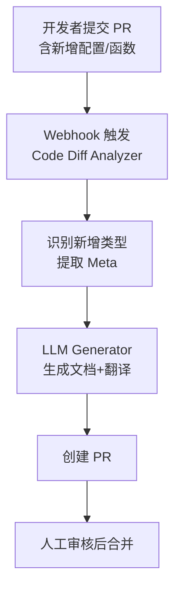
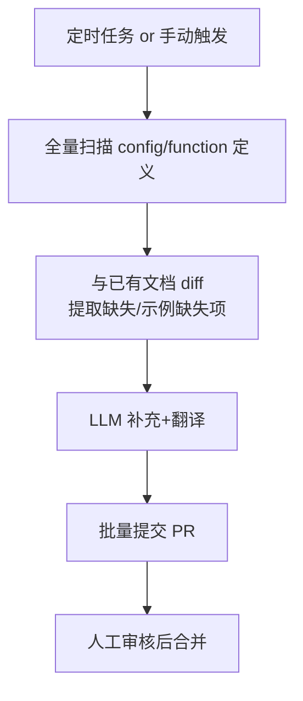

```markdown
# StarRocks 文档自动化系统开发文档

## 1. 背景与目标

### 1.1 背景
- 配置项变更频繁（新增、修改默认值、作用域变更），人工更新文档滞后。
- 中英文文档不一致，翻译成本高，术语不统一，影响用户体验。

### 1.2 目标
构建基于**源码解析 + LLM 生成 + 人工审核**的自动化文档生成机制，实现：
- 文档与代码同步更新
- 降低维护成本
- 提升文档质量

### 1.3 支持范围
- Session variable
- Global variable
- FE config
- BE config
- Scalar Function
- Aggregate Function
- Window Function

---

## 2. 子目标与验收标准

| 子目标       | 描述                                            |
| ------------ | ----------------------------------------------- |
| ✅ 自动化提取 | 从源码自动提取函数、配置、变量的元信息          |
| ✅ 智能生成   | 基于 LLM 自动生成函数说明、参数解释、示例等内容 |
| ✅ 多语言支持 | 支持中/英/日三语输出，术语统一                  |
| ✅ 风格统一   | 与 StarRocks 官方文档风格一致                   |
| ✅ 可验证性   | 示例可运行，支持自动验证                        |
| ✅ 人工审核流 | 所有生成文档需 PR 审核；可引入 AI 交叉 review   |

---

## 3. 技术方案总览

### 3.1 核心思路
用 **Meta + 模板** 替换掉当前直接手写文档的方式：  
Code Diff → 提取 Meta → LLM 生成文档 → 翻译 → PR → 人工审核 → 合并

### 3.2 触发方式
#### 3.2.1 PR 触发（增量）


#### 3.2.2 手动/定时触发（全量）


---

## 4. 代码提取策略

| 目标        | 提取锚点                            | 辅助手段                 | 输出 Meta 示例                                                    |
| ----------- | ----------------------------------- | ------------------------ | ----------------------------------------------------------------- |
| Variable    | `VariableMgr.VarAttr`、set/getField | 正则 + tree-sitter       | {"name":"enable_udf","type":"boolean","defaultValue":"false",...} |
| FE Config   | `@ConfField` 注解                   | grep 使用处              | {"name":"enable_udf","scope":"FE","isMutable":"false",...}        |
| BE Config   | `CONF_*` 宏定义                     | grep 使用处              | 同上，scope=BE                                                    |
| Scalar 函数 | `functions.py` 定义 + C++ 签名      | 正则 + 静态分析          | {"name":"abs","signature":["DOUBLE abs(DOUBLE)"],...}             |
| 聚合/窗口   | `FunctionSet` 注册点                | 重构为可解析列表（TODO） | 同上                                                              |

> 工具链：正则 + tree-sitter + Python 脚本，统一输出 JSON Meta。

---

## 5. LLM 文档生成流程

### 5.1 输入
单个 Meta JSON（增量）

### 5.2 输出
填充后的 Meta，含以下字段：
```json
"documents": {
  "zh": "# abs\n## 语法\n...\n## 示例\n```sql\nselect abs(-3);\n-- 结果 3\n```",
  "en": "# abs\n## Syntax\n...",
  "ja": "# abs\n## 構文\n..."
}
```

### 5.3 多 Agent 协作
| Agent 职责         | 说明                                          |
| ------------------ | --------------------------------------------- |
| Doc Generator      | 根据 Meta 生成中/英/日三语 Markdown           |
| StarRocks Executor | 连接测试集群，自动生成并验证 SQL 示例（可选） |
| Translator         | 基于 LLM 做术语对齐的多语言翻译               |

### 5.4 Prompt 模板（函数示例）
```text
You are a professional StarRocks technical documentation engineer.
Based on the following JSON Meta, generate a Chinese function reference
that conforms to the official StarRocks style.
Chapters: #Function Name / ##Syntax / ##Parameter Description / ##Return Value / ##Description / ##Example
Provide executable SQL examples and explain the result.
JSON:
{ ... }
```

---

## 6. 文档部署与版本管理
### 6.1 版本管理
维护 **首次引入版本** 映射：
```json
"version-3.3.1": ["activate_all_roles_on_login", "auto_increment_increment"],
"version-3.3.2": ["autocommit"],
"version-3.3.3": ["cbo_json_v2_rewrite"]
```
实现方式：
1. 拿到全部 tag（v1.* / v2.* / v3.*）并按语义排序。
2. 对每个 tag 执行 `git show tag:Config.java` 提取字段。
3. 若字段第一次出现，记录该 tag 为“首次引入”。

---

## 7. 技术选型

| 模块         | 技术方案               | 备注                          |
| ------------ | ---------------------- | ----------------------------- |
| 代码解析     | tree-sitter + 正则     | 统一 Python 脚本              |
| Agent 编排   | LangGraph              | 支持多 Agent 协作、缓存、重试 |
| PR 自动创建  | GitPython + GitHub API | 自动生成分支、commit、PR      |
| 文档站点集成 | StarRocks 官网 CI      | 部署阶段 `meta → md`          |

---

## 8. 目录结构建议
```
docs-agent/
├─ meta/               # JSON Meta 仓库
|  ├─ version/
│  ├─ variable/
│  ├─ config/
│  ├─ scalar_func/
│  ├─ agg_func/
│  └─ window_func/
├─ src/
|  ├─ code_extract/    # code -> meta
|  ├─ docs_extract/    # docs -> meta
|  ├─ agents/
|  ├─ config/
|  └─ tools/
└─ tests/
```

---

## 9. 开发环境管理
使用 poetry 管理 python 环境，使用的 python lib：

```
tree-sitter 
tree-sitter-java 
tree-sitter-python 
tree-sitter-cpp

langgraph
gitpython
loguru
```